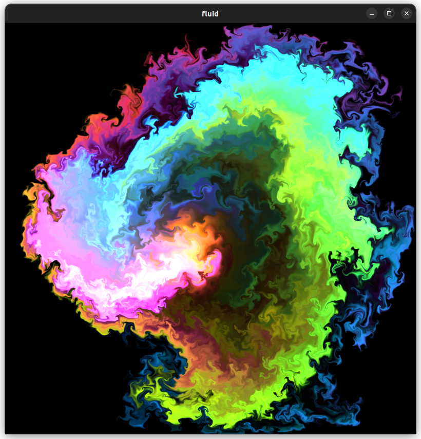

# Demonstrates reflected graphics pipeline usage

2D fluid simulation ported from [here](https://paveldogreat.github.io/WebGL-Fluid-Simulation/)

# Controls
click and drag to push the fluid

# Output
