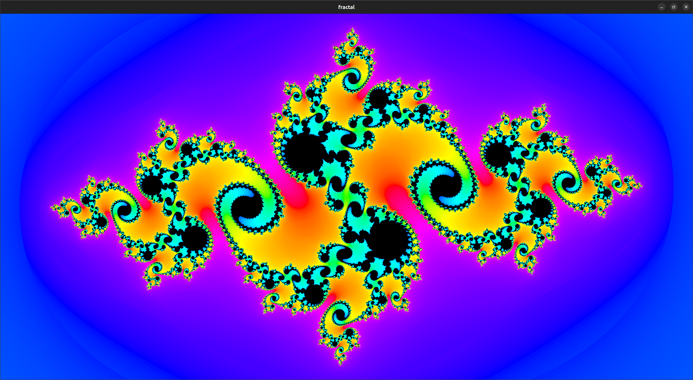

# Demonstration reflected graphics pipeline usage

Mandelbrot / Julia set explorer

# controls
- return - reset to default
- tab - switch from mandelbrot to julia set
- wasd - move around
- arrow keys - move start point around
- t - shift color up
- y - shift color down
- shift - slow movement by 10
- ctrl - slow movement by 100

# Output

