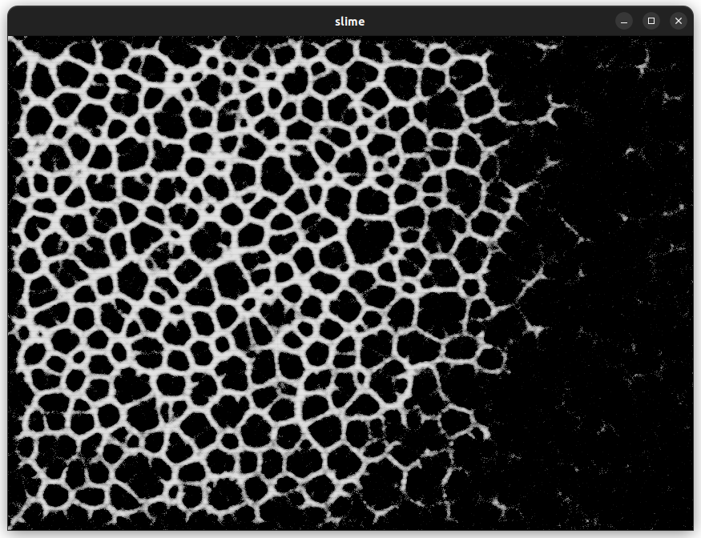

# Demonstration of reflected compute pipeline

Simulation of a slime mold ported from [here](https://www.youtube.com/watch?v=X-iSQQgOd1A)

# controls
resize the window to give more / less space to the slime

# Output
